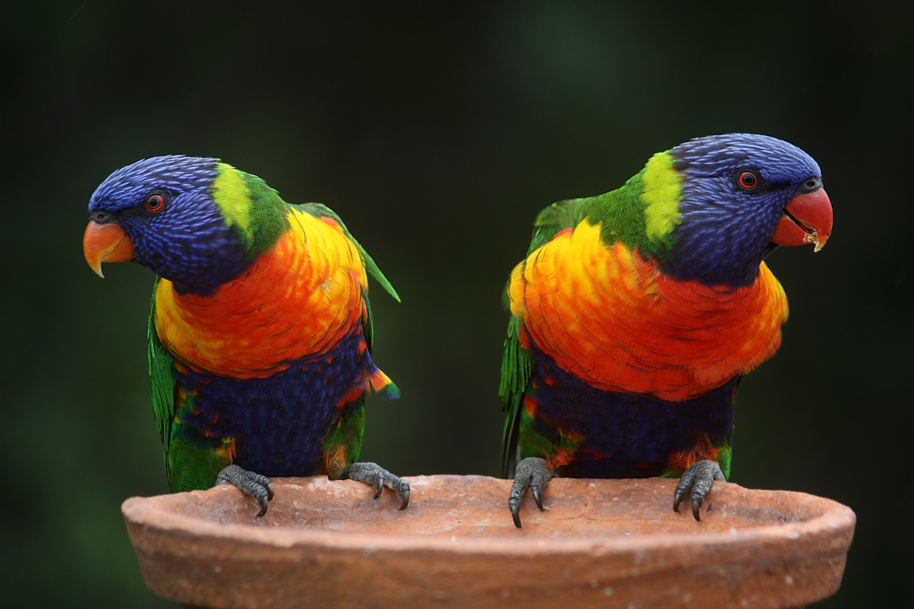
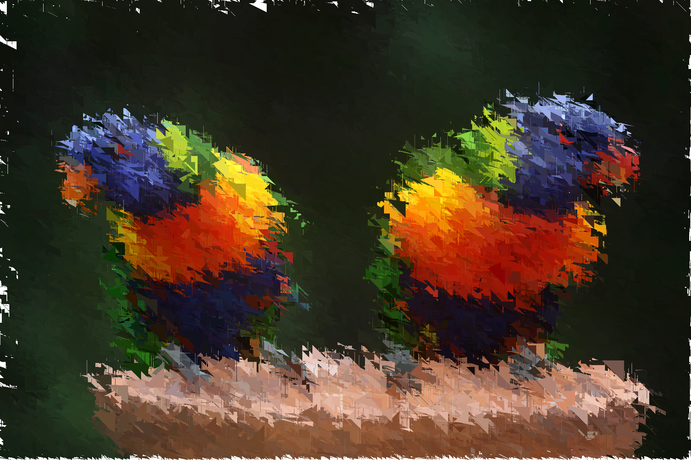
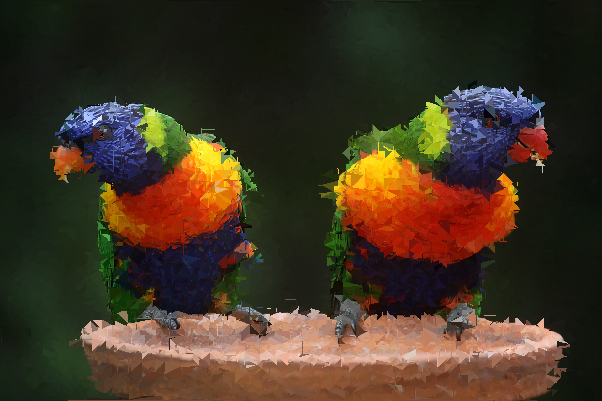
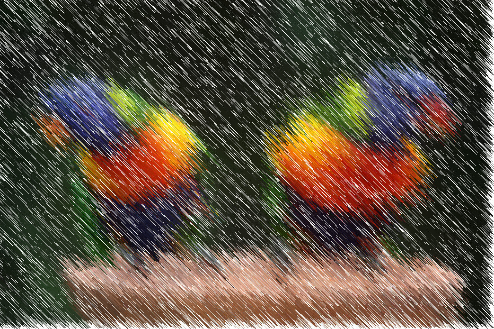
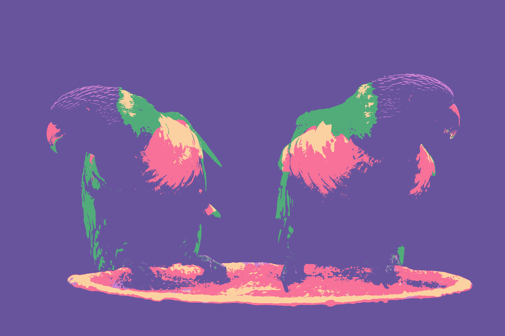
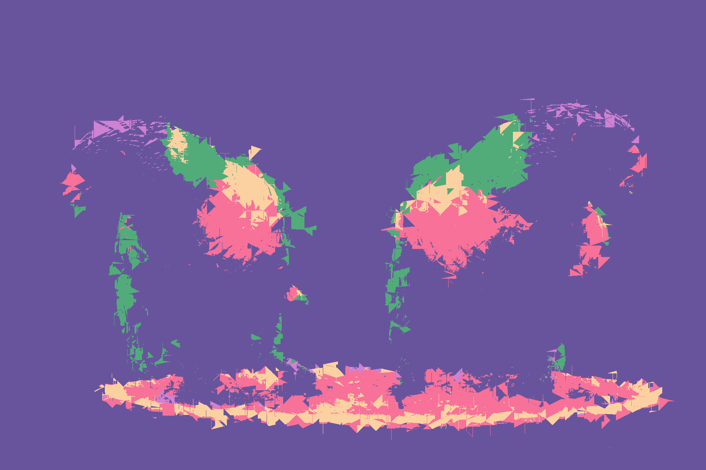
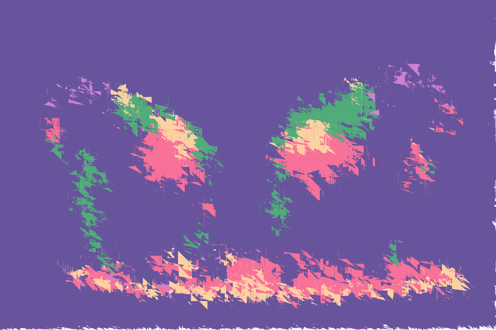

# qimage

qimage is an experimental toolset that consist of various image effects generally built on quantization.

## Prerequisites

- Go 1.18
- Python 3

To install python dependencies you can run the command in below.
```
pip3 install -r effects/requirements.txt
```

## What are the capabilities qimage can do?

- Random Triangulation
- Uniform Trangulation
- Line Effect
- Color Palette

You can see the base image in below.


### Random Triangulation

It picks dozens of random triangle places from given input picture and then fills those areas with the frequent colors within the triangle.

```
go run cmd/main.go --f examples/example.png --o examples/example_tr.png --tr true
```

Output:


### Uniform Triangulation

Does same thing with uniformly distributed triangles.

```
go run cmd/main.go --f examples/example.png --o examples/example_tu.png --tu true
```

Output:


### Line Effect

It works with the same logic that random triangulation has but with inverting maximum and minimum edge lengths configurations. So, it creates random lines on the all area of picture.

```
go run cmd/main.go --f examples/example.png --o examples/example_l.png --l true
```

Output:


### Color Palette

It turns out all the colors into the closest color of given color palette.

```
go run cmd/main.go --f examples/example.png --o examples/example_cp.png --cp "247,113,153:252,209,161:207,129,210:81,172,122:104,84,157"
```

Output:


And you can combine all the effects with color palette!

Uniform Triangulation with Color Palette:
```
go run cmd/main.go --f examples/example.png --o examples/example_tu_cp.png --cp "247,113,153:252,209,161:207,129,210:81,172,122:104,84,157" --tu true
```


Random Triangulation with Color Palette:
```
go run cmd/main.go --f examples/example.png --o examples/example_tr_cp.png --cp "247,113,153:252,209,161:207,129,210:81,172,122:104,84,157" --tr true
```



## Credits
Thanks to [@ijmbarr](https://github.com/ijmbarr) for providing this excellent work https://github.com/ijmbarr/images-to-triangles!